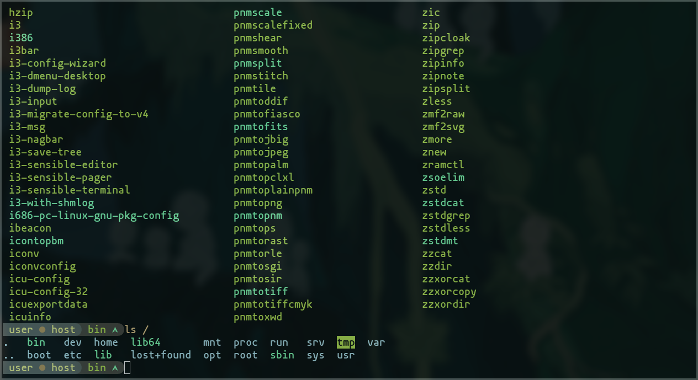
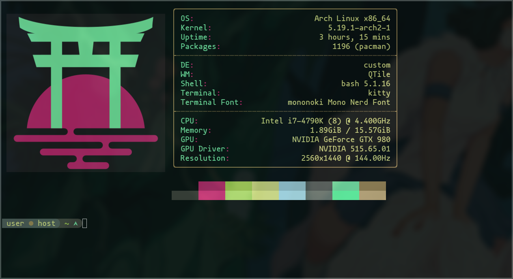
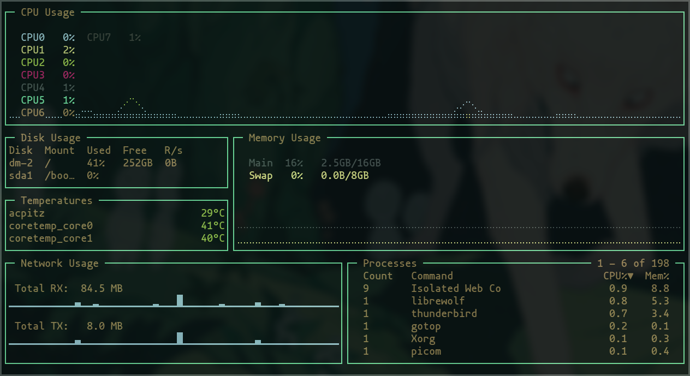
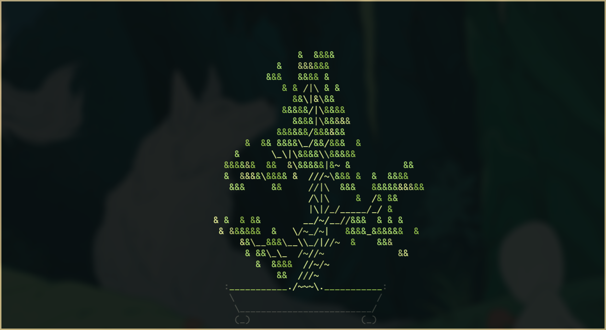

# Mokujin Terminal Theme
A theme for unix terminals based on the Mokujin colorway


## About
These are just a few config files to quickly set up my terminals with this theme.

The files have been simplified and reorganized a bit for my preferences from the default.  Mostly just the font and colour sections have been changed and the rest is set to default behaviour, keybind, etc.  You can drop them in to try them out, or part them out for whatever.

Also, I've found that kitty seems to render fonts a little more nicely so that's what the screenshots reflect.


## Features
- Dotfile for kitty terminal
- Dotfile for alacritty terminal
- PS1
- Terminal colour list


## Screenshots
<br>
<br>
<br>
<br>


## Requirements
- **mononoki Nerd Fonts** or **Nerd Fonts Complete**
- **kitty** or **alacritty** or any terminal that supports custom rgb colours and fonts
- PS1 is written for bash but may work with other shells


## Installation
### Fonts
For arch users the Nerd Fonts can be found in **aur**.

```
yay -S nerd-fonts-complete
```

## Configuration
Swapping in the dotfiles or editing your own should be pretty obvious.  The PS1 needs to be added to your `.bashrc` file (or similar) to work.


## Troubleshooting
If you're experiencing text rendering issues, make sure the necessary font packages in the requirements section are installed and update your font cache with `fc-cache -f`.  


## Contributing
If you use some other terminal and want to share your config for this theme, send me a pr.


## License
This software is licensed under the GNU General Public License v3+.  See LICENSE for details.
